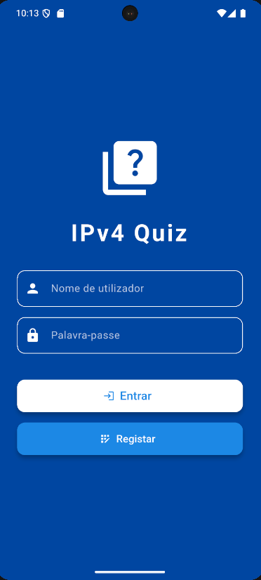
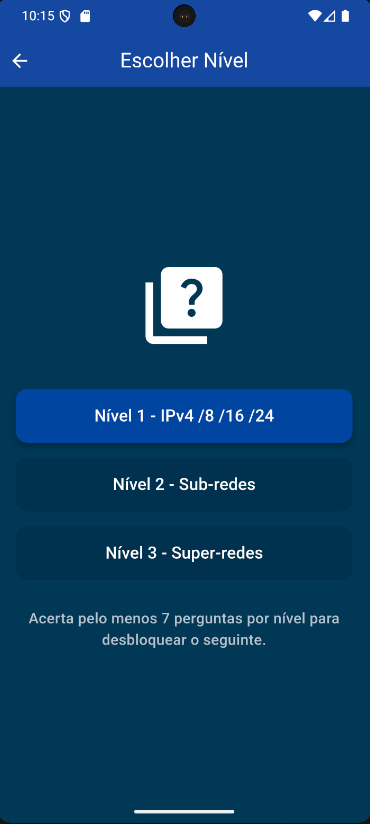
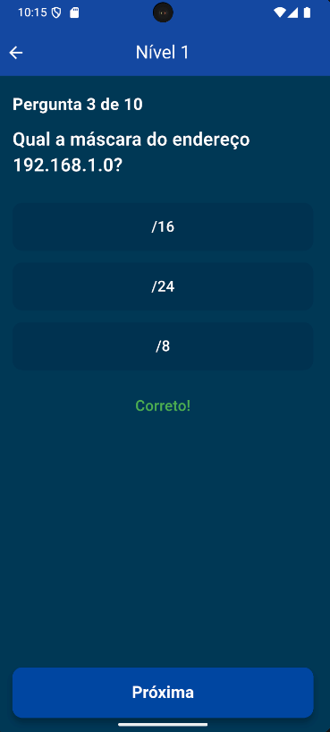

# IPv4 Quiz App

Este é um aplicativo Flutter desenvolvido para ajudar na capacitação sobre IPv4, utilizando quizzes interativos que tornam o aprendizado mais dinâmico e divertido. A ideia é oferecer uma experiência prática e motivadora para quem quer entender melhor os conceitos de endereçamento IP, com funcionalidades que incentivam o progresso contínuo.

## Funcionalidades

- Sistema de login e cadastro usando SQLite para armazenar usuários e pontuações localmente.
- Quizzes interativos focados em IPv4, para você testar e expandir seus conhecimentos.
- Ranking por medalhas (ouro, prata, bronze) que mostra os melhores jogadores e incentiva a competição saudável.
- Histórico dos seus scores, para acompanhar seu desempenho ao longo do tempo.
- Feedback personalizado com mensagens motivacionais que te ajudam a continuar aprendendo.
- Interface responsiva e estilizada feita com Flutter, com animações e widgets personalizados, como ícones de medalhas saltitantes.

## Tecnologias usadas

- Flutter & Dart — para desenvolvimento da interface e lógica do app.
- SQLite — banco de dados local para persistência de dados.
- Widgets personalizados para animações e interatividade (ex: medalhas saltitantes).

## Como executar

```bash
# Clone este repositório
git clone https://github.com/goncaloliveira-dev/ipv4-quiz.git

# Entre na pasta do projeto
cd ipv4-quiz

# Baixe as dependências
flutter pub get

# Execute no emulador ou dispositivo
flutter run
```
